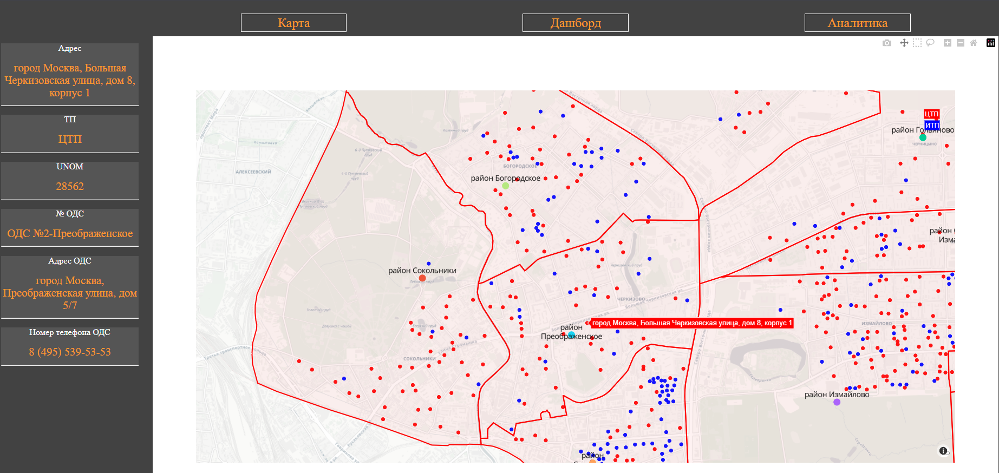
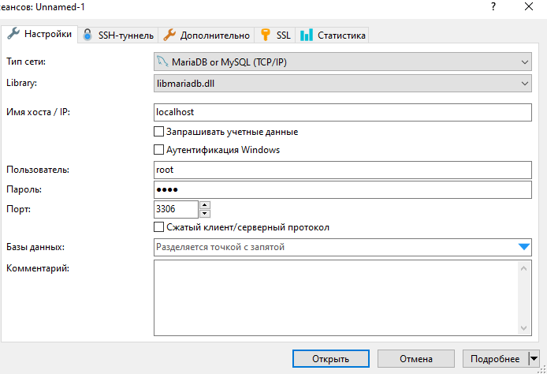
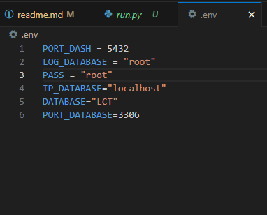
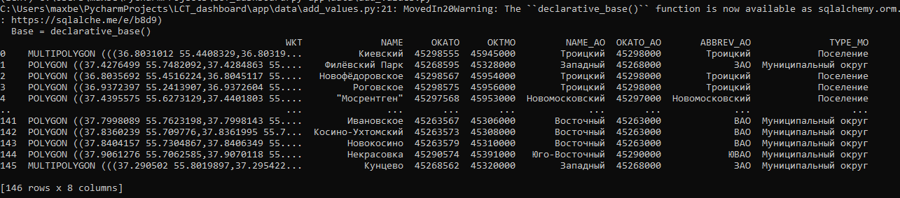

# ЛЦТ 2024
## Задача 10 Сервис прогнозирования возникновения аварийных ситуаций

## Не доделанный проект в связи с выходом из хакатона по рабочим причинам (отсутствие времени на проект)

## Целевые задачи сервиса (из ТЗ)

Целевые задачи сервиса
Работа сервиса должна делиться на 2 целевые задачи:
1. Прогнозирование:
Анализ загруженных в систему массивов данных и сценарное
прогнозирование вероятного наступления события.
Источники данных:
* Сервис должен анализировать массив данных по событиям (берем
источники данных – АСУПР, ЕДЦ, КГХ, МЖИ, Наш Город, ЭВАЖД,
РКИИЭ) на основе прошлых периодов (далее в тексте “Первичные
данные”);
* Сервис должен анализировать показания ПУ (приборов учета) –
АСУПР;
* Сервис должен анализировать характеристики зданий/объектов (год
постройки, год кап.ремонта);
* Сервис должен анализировать данные о проведенных ремонтных
работах;
На основании источников данных:
* Сервис должен учитывать изменения массивов первоначальных
данных;
* Сервис должен обновлять/пересчитывать итоговые аналитические
данные на фоне дозагрузки новых данных или
изменения входных данных;
* Сервис должен давать возможность посмотреть аналитические
данные по всей карте и/или по заданным
критериям фильтрации;

2. Реагирование:
Модель реагирования на уже произошедшее событие.
Источники данных:
* Сервис должен учитывать температуру наружного воздуха и погодные
условия (почасовой прогноз);
* Сервис должен учитывать материалы и конструктивное исполнение
наружных стен;
Образ результата: Модель реагирования с таймлайном, которая должна
состоять из:
* Схемы теплоснабжения (ТЭЦ - Тепловая камера – Источник (ЦТП) / ИТП
    - Список объектов, ранжированных по степени остывания) с
    обозначением места возникновения аварии на карте (градиент
    остывания объектов) и принадлежность ОДС к источнику
    тепла/потребителю с указанием адреса и контактного номера
    телефона ОДС.
* Реестр объектов, отфильтрованных по типу, начиная от особо важных –
см. критерии приоритезации с указанием полной информации об
объекте, его режим работы.
* Графическое представление скорости и период наступления
температуры ниже нормативной (18 °C) выбранного объекта, в
зависимости от его теплотехнических характеристик (материал и
конструктивное исполнение наружных стен) и погодных условий

## Структура проекта

```
+--app
|  +--callback
|  |   +-- callback.py --> Файл с обратными вызовами для взаимодействия интерфейсом
|  |
|  +--data
|  |   +-- add_values.py --> Файл с созданием таблиц и добавлением данных в них из csv файлов
|  |   +-- administartion_district.csv --> csv файл с информаций о Административных округах
|  |   +-- CTP.csv --> csv файл с информаций о источниках теплоснабжения
|  |   +-- Municipal_area.csv --> csv файл о Муниципальных округах
|  |   +-- ODS_INFO.csv --> csv файл о Объединенных диспетчерских службах
|  |   +-- mo.csv --> csv файл о Муниципальных округах c геокоординатами
|  |   +-- ao.csv --> csv файл о Административных округах c геокоординатами
|  |
|  +--database
|  |   +-- database.py --> Файл с создание подключения к БД
|  |
|  +--function
|  |   +-- function_app.py --> Файл c вызываемыми функциями
|  |
|  +--models
|  |   +-- models.py --> Файл с моделями БД
|  |
|  +--query
|  |   +-- query.py --> Файл с запросами в БД
|  |
|  +--schems
|  |   +-- schem.py --> Файл с pydantic схемами для запросов и БД
|  |
+--assets
|  +-- css
|  |   +-- main_01.css -> Файл с стилями для главной страницы
|  |
+-- docs  -> Папка с информа. для документации
|  +-- Image_1.png
|  |
+-- requiremets.txt -> файл с библиотеками
|
+-- .env -> файл с конфигурационными настройками (порт,БД)
|
+-- main.py -> файл запускающий веб-интерфейс
```

## Реализованное в проекте

1. Веб-интерфейс с картой
2. Вывод Объектов ЦТП\ИТП
3. Вывод информации о конкретном ЦТП\ИТП при нажатии
4. Вывод Муниципальных округов для одного административного округа (Восточный)
5. Создание и заполнение базы данных по скрипту add_values.py



## Установка

```
1. Клонируем или скачиваем проекта с гита 
2. Переходим в папку с проектом

3. Установка среды выполнения

    sudo python3 -m venv lenv

4. Установка библиотек и зависимостей

    Сначала активируем среду

    Переходим в консоль

    source lenv\bin\activate -- для linux

    lenv\Script\activate -- для Windows

5. Устанавливаем библиотеки след. командой

    sudo pip3 install -r requirements.txt -- linux

    sudo pip install -r requirements.txt -- Windows
    
6. Скачиваем \ Устанавливаем MySQL-Server \ Создаем сервер * (В главе полезной информации есть ссылка на то, как скачать и создать MySQL-Server)

6.1 При создании использовал стандартные настройки для пользователя и порта

7. Подключаемся к MySQL-Server (я использовал HeidiSQL)
```


```
8. Создаем базу данных наименование запоминаем.

9. В папке проекта открываем .env файл
```


* PORT_DASH - Порт на котором будет запускаеться веб-сервис
* LOG_DATABASE - Имя пользователя

* PASS - Пароль для подключения к MySQL-Server

* IP_DATABASE - Имя хоста / IP

* DATABASE - Наименования базы данных (то которое указывали при создании в 8-ом пункте) 

* PORT_DATABASE - Порт для подключение к MySQl-Server

```
10. В папке проекта запускаем скрипт

py app\data\add_values.py - Windows

python3 app\data\add_values.py - Linux

При успешном завершении будут следующие логи
```



```
В случае не удачи, можете отправить проблему с которой столкнулись (если будет желаение)

11. Запускаем веб-сервис след командой:

py main.py - Windows

python3 main.py - Linux
```

## Примечания
Выбор фреймворка Dash был обусловлен из-за отсутствия на проекте фронтендера

В проекте отсутсвует львиная доля функционала который был описан в ТЗ на хакатоне.Здесь больше то как можно реализовать вывод информацию на карту с помощью фреймворка Dash (Может и не самыми правильными способами и методами из-за отсутсвия оптимизации).

Верстака делалась под разрешение 1920x1080 на иных разрешениях не проверялась

## Полезная информация

https://metanit.com/sql/mysql/1.1.php * -> Для создание MySQL сервера

https://dash.plotly.com/ -> Документация по фреймворку

https://newtechaudit.ru/geograficheskaja-karta-interaktiv-markeri-plotly-dash/ -> Работа с интерактивными картами на Dash

https://habr.com/ru/companies/skillfactory/articles/521840/ -> Работа с интерактивными картами на python